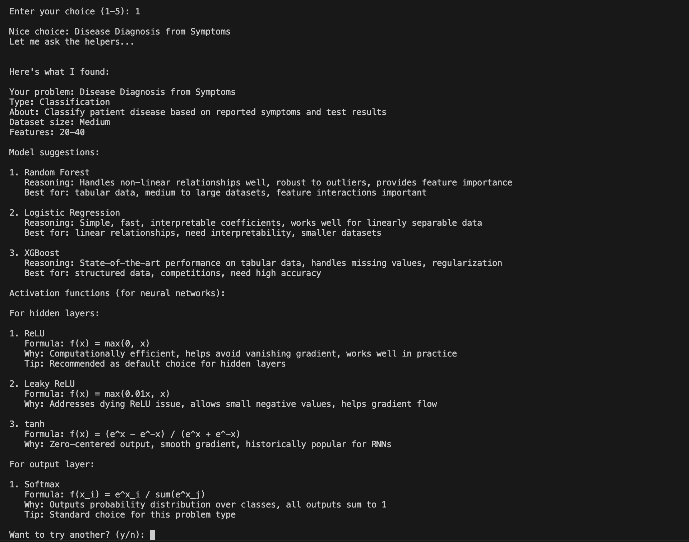

# Story

As the core of A2A is Agents taking care of specific capabilities coming together to address the Natural Language Queries of the users in realtime scenario, after a bit of thought, decided to take current Machine Learning/Deep Learning related content itself as the problem statement to experiment for this project.
Decided to use some of the factual data learned in Semester 1 of M1 as static data to focus on core A2A concept exploration, decided to treat Model and actication function identification for a given practical usecase itself as requirement to implement 2 Agents using A2A core conventions.

# ML Recommendation System

A simple Agent2Agent (A2A) protocol implementation that recommends ML models and neural network configurations.

## What it does

Two helper agents suggest ML approaches for your problem:
- **Model Agent**: Recommends models based on problem type
- **Activation Agent**: Suggests activation functions for neural networks

While running the Client, use can choose 1 of 15 different ML problems and get personalized recommendations from 2 different A2A agent as a demonstration.

## How it works

**The Protocol**
- Agents communicate through simple messages
- Each agent declares what it can do
- Client discovers and asks agents for help

## A2A Implementation Summary

This project implements core A2A Protocol features:

**Agent Cards**: Each agent provides metadata including name, version, description, and available capabilities. Clients can query agent cards to understand what each agent does.

**Capability Schemas**: Every capability declares its expected input parameters and output format, enabling validation and documentation.

**Agent Discovery**: Instead of hardcoding agent references, the client uses AgentRegistry to discover agents by capability at runtime.

**Message Protocol**: Standardized Message class for all agent communication with request/response pattern.

**Modularity**: Agents are independent with separate knowledge bases (JSON files), making them easy to update or replace without affecting others

## Simple Demonstration

## Outcome of the Project

This project demonstrates A2A protocol basics through a practical ML recommendation system. Two specialized agents collaborate via standardized messages to help users select appropriate models and configurations. While simplified for learning purposes, this project enabled understanding of the core concepts that make multi-agent systems powerful: modularity, specialization, and protocol-based communication.

Implemented the code with minimal dependencies outside the project, and focuses on clarity. The project helped learning about A2A protocols, multi-agent systems, enbled understanding of how agents can work together.
