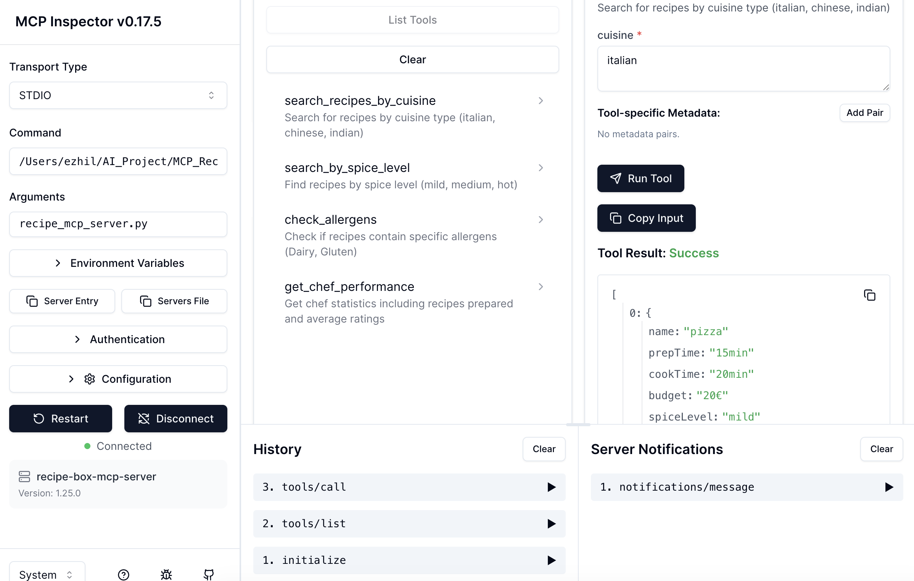

# Story

A cross over project, as part of University assignment, using RDF/SPARQL represented the Ontology/knowledge graph for recipes, chefs and various intricate data relationships to explore SPARQL as in other parallel projects in my repository.
While exploring MCP, had a curious question of, would it be possible to enable access to the recipes in knowledge graph for an Agent in Agentic AI world, hence this exploration!

# Recipe Box MCP Server

A Model Context Protocol server that lets AI assistants query recipe data from an RDF knowledge graph. Built for a hybrid AI workflow combining structured semantic data with LLMs.

## MCP Server implementation

This MCP server exposes recipe information stored in RDF/Turtle format through MCP tools that AI assistants can use. It's designed to demonstrate how to bridge semantic web technologies (RDF, SPARQL, ontologies) with modern AI applications.

The server can:
- Search recipes by cuisine type (Italian, Chinese, Indian)
- Filter recipes by spice level (mild, medium, hot)
- Check which recipes contain specific allergens (Dairy, Gluten)
- Analyze chef performance and ratings

## The Data

The Recipe Box Ontology contains:
- 4-5 recipes: Pizza, Noodles, Paneer Masala, Caesar Salad, Chicken Soup
- 3 chefs with their contact info, and recipes
- 2 customers with their orders and reviews
- Nutritional information for each recipe
- Allergen data for ingredients
- Gastronomy metadata  (cuisine types, spice levels, cooking styles)

All this lives in `rbox.ttl` - a Turtle RDF file that represents the knowledge graph.

## Setup

We need Python 3.10 or latest version.

Created a venv and installed dependencies:
To keep it simple,  stored `rbox.ttl` in the same directory as the MCP Server `recipe_mcp_server.py`.

## Running the Server

The server communicates via STDIO (standard input/output), which is how MCP clients connect to it, though other options were there, explored simple option.

Tested it with the MCP Inspector for quick validation:
This opens a web interface at http://localhost:6274 or a random port, where we can test the tools served by MCP server.

## Simple Demonstration

## How It Worked

In the server code, I used RDFLib to load the Turtle file from other project to load the data into an in-memory graph. When a tool is called, it executes a SPARQL query against this graph and returns the results as JSON.

For example, searching for Italian recipes runs a SPARQL query that:

Finds all recipes with `ex:hasCuisine d:italian`

The code returned the results formatted as a list of recipe objects

#### References

MCP Documentation: https://modelcontextprotocol.io

RDFLib: https://rdflib.readthedocs.io

SPARQL: https://www.w3.org/TR/sparql11-query/
