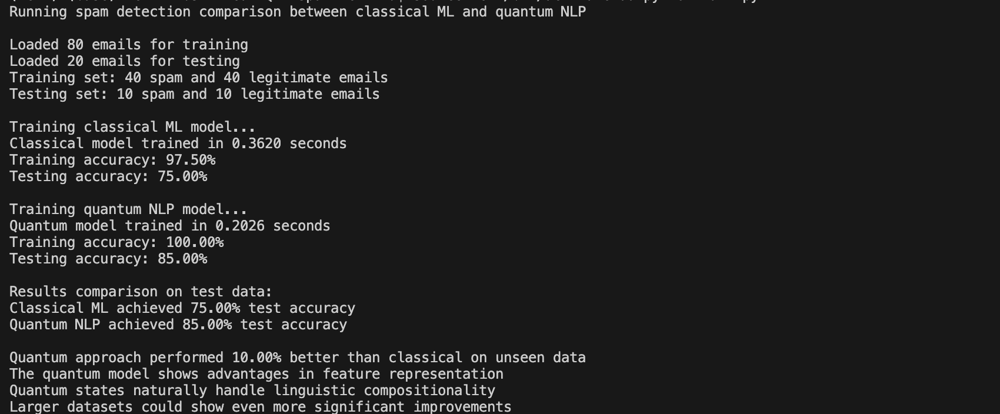

## Story

While experimenting with sentiment analysis and spam detection, wished to check if there is a possibility to optimize the task, spam detection could be a interesting usecase to experiment on one end and Quantum inspired NLP appeared promising to complete the task but way more optimally.

## QNLP Spam Detection

Simple implementation comparing classical ML and Quantum NLP approaches for spam detection.

### Dataset

Used 100 sample emails:
- 50 legitimate emails
- 50 spam emails
Based on the sample spam_ham_dataset.csv downloaded from Kaggle.

### Implementation details

Utilizing the simple machine learning approach of performing forward pass, loss detection, back propagation and optimization implemented usual ML based solution to compare against the Quantum inspired transformation for ML.

Implemented Classic ML code using Traditional neural network using PyTorch with bag-of-words vectorization.
Implemented Quantum NLP code using Quantum-inspired neural network with quantum layer transformations.
Used a data utility to fetch the sample email dataset in the CSV format from Kaggle using pandas.
Executed the inference on the sample email dataset and calculated accuracy, time taken to do the training and Compared the results to check the advantages of Quantum Computing for Machine Learning.

## Simple Demonstration

## Result of the experiment

Used CountVectorizer with a simple feedforward neural network for Classical ML approach.

Used Quantum NLP quantum-inspired transformations with embedding layers and quantum parameter matrices for enhanced feature representation.

The comparison demonstrates both approaches on spam classification, showing training time and accuracy metrics.

Quantum NLP had a edge on accuracy and time complexity!
